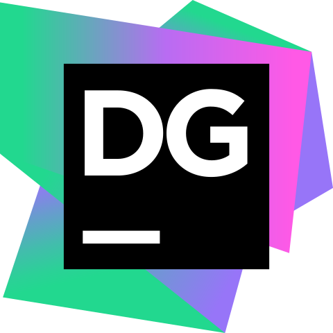

# 👋 Introduction
Hi, I’m Jules, a junior developer with a Bachelor's degree in IT (BUT Informatique).

I love web development and development in general.
I enjoy working on various projects and creating small personal projects.

# 💻Technologies

### 📱Technologies I know

  

### 🔨Tools I know

  
  
  
  
  
  
  
  
  

### 🎓Currently learning

  

### 🔍Wanting to learn

  

# 🚀Projects

- 🚧: indicates that the project is not finished but in progress
- ❌: indicates that the project has not started but is planned

### 🌟AnimeDle🚧
AnimeDle is an exciting project where users can put their anime knowledge to the test. The concept is simple yet engaging – guess the anime from blurred images! Users will be presented with images of different anime scenes that are intentionally blurred. The challenge is to correctly identify the anime based on these obscured visuals. The AnimeDle project is currently under development, and I'm actively working on creating a website.

[Check out Animedle on GitHub](https://github.com/Juless54/Animedle)

# 📈My stats

